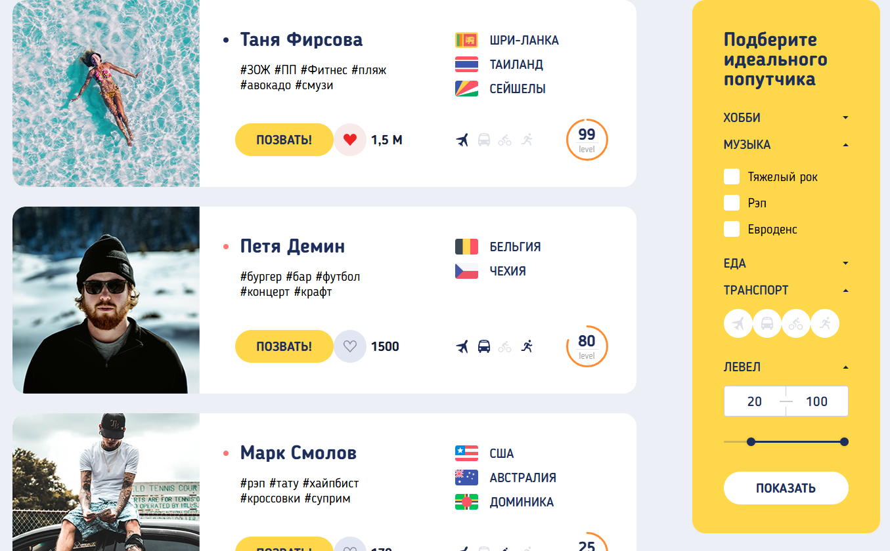

# Попутчик

Учебный проект части сервиса по поиску попутчиков в путешествиях с фильтрацией по интересам пользователей

Здесь позже будет ссылка на сайт

## Стек технологий
- HTML5
- CSS3
- Javascript(ES6+)

## Особенности
- **Адаптивный сайт** - корректно отображается на устройствах c viewport от 300px
- **Фильтрация** - работает фильтрация по категориям, пока 4 пользователя
- **Генерация карточек пользователей** - при фильтрации осуществляется генерация карточек пользователей из JS
- **Гибкая верстка** - в большинстве сценариев предусмотрено наполнение большим количеством данных от пользователей, верстка не ломается при длинных именах, большом количестве элементов в массиве
- **Реализован собственный Double-Slider** - реализован двойной слайдер на чистых HTML/CSS/JS, который связан со *stepper*'ом. Если оба ползунка ближе к левому краю, выше стоит правый ползунок, если наоборот - то левый
- **Возможность проходиться с помощью Tab** - реализовано поведение перемещения по кнопкам и интерактивным элементам с помощью Tab, по скрытым элементам tab не проходит

## Запуск
1) Для локального запуска можно открыть index.html (все остальные файлы проекта должны лежать рядом), для этого можно клонировать данный проект
(если установлен git) или скачать *.zip* архив и распаковать.
Для дальнейшей разработки можно воспользоваться Live Server в VS Code или аналогом в WebStorm
2) Чтобы просто посмотреть сайт, достаточно перейти по ссылке выше
